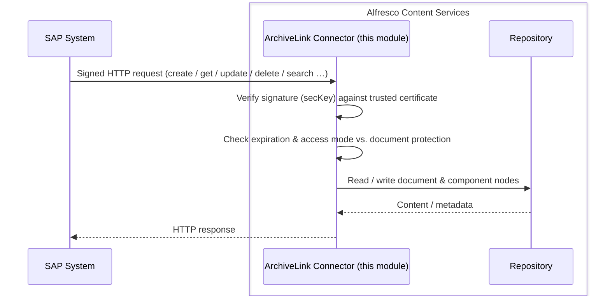
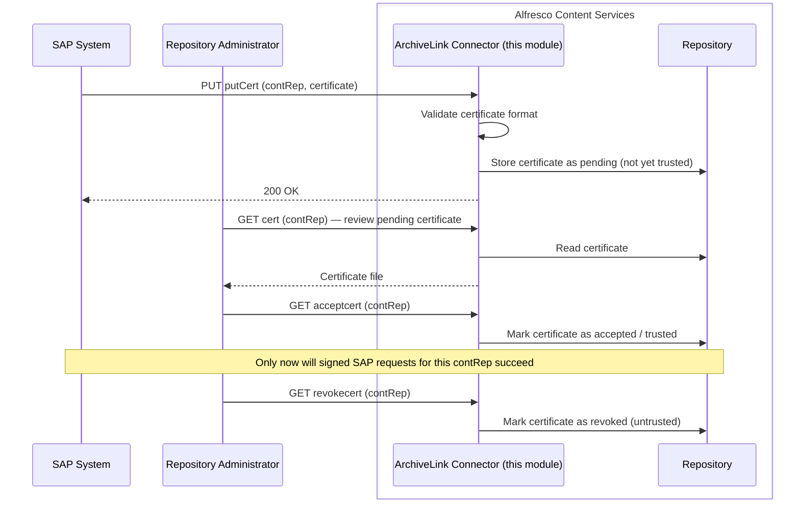

# Alfresco SAP ArchiveLink Connector

[](LICENSE)
[](https://www.alfresco.com/)
[](https://openjdk.org/)

**A free, open-source SAP ArchiveLink content repository, built on Alfresco Content Services.**

SAP systems talk to document archives over a standard, vendor-neutral protocol called
[ArchiveLink](https://help.sap.com/docs/SUPPORT_CONTENT/archivelink). Most teams end up paying for a
proprietary archive server just to speak that protocol — a separate product to license, host and
maintain, on top of whatever ECM platform they already run. This project removes that requirement:
it's a self-hosted, fully open-source module that turns [Alfresco Content Services](https://www.alfresco.com/)
into a fully-functional SAP ArchiveLink repository, with no per-GB or per-connector licensing.

## Why this exists

* **No archive-server license.** Alfresco Content Services Community Edition is free and open source
  — combined with this module, the whole stack costs nothing to license.
* **You own your data.** Documents live in a standard Alfresco repository you control, not in a
  closed proprietary store.
* **Source-available.** Every part of the ArchiveLink protocol handling — signature verification,
  certificate trust, document/component storage — is here to read, audit and extend.
* **Runs anywhere Alfresco does.** On-prem, in a container, in your own cloud — no vendor-hosted
  dependency required.

## How it fits together



### Certificate trust flow

Signed requests are only trusted once a repository administrator has explicitly reviewed and
accepted the certificate SAP submits — the connector never trusts a certificate on its own:

1. **SAP submits its certificate** via `putCert`, once per content repository (`contRep`). The
   connector validates that it's a recognizable certificate/public-key format and stores it, but
   marks it as **pending** — not yet trusted for signature verification.
2. **An administrator reviews it** via the `cert` endpoint, which downloads the pending certificate
   file for inspection.
3. **An administrator accepts it** via `acceptcert`. Only from this point on will signed SAP
   requests for that `contRep` pass signature verification and be allowed through.
4. **An administrator can revoke trust** at any time via `revokecert`, which immediately blocks
   further signed requests for that `contRep` until a certificate is accepted again.

Unlike the ArchiveLink data endpoints (which have no Alfresco-level authentication — trust comes
entirely from the signature check), the `cert`, `acceptcert` and `revokecert` endpoints require an
authenticated Alfresco **admin** session, so certificate trust decisions are always made by a human
with repository admin rights.



## Features

The module exposes the standard ArchiveLink HTTP interface (`GET`/`PUT`/`POST` against a single
endpoint, dispatched by the `command` query parameter) and implements the following functions:

| Function       | Method | Description                                    |
|----------------|--------|-------------------------------------------------|
| `info`         | GET    | Retrieve information about a document           |
| `get`          | GET    | Fetch a content unit of a component (with range) |
| `docGet`       | GET    | Fetch the entire content of a document          |
| `create`       | PUT/POST | Create a new document                         |
| `mCreate`      | POST   | Create multiple documents in one request        |
| `append`       | PUT    | Append data to a component                      |
| `update`       | PUT/POST | Modify an existing document                   |
| `delete`       | GET    | Delete a document or component                  |
| `search`       | GET    | Search within a document's content              |
| `attrSearch`   | GET    | Search for attributes in a document              |
| `putCert`      | PUT    | Register a client certificate                    |
| `serverInfo`   | GET    | Retrieve information about the content server    |

Requests are secured using the SAP ArchiveLink signature scheme: SAP signs each request URL with a
private key, and the module verifies the signature (`secKey`) against the public key/certificate
registered for the calling content repository (`contRep`), checks the request's expiration and the
requested access mode (`accessMode`) against the document's protection level (`docProt`). Certificate
management endpoints (`acceptcert`, `cert`, `revokecert`) let an administrator review and accept
certificates submitted by SAP before they're trusted.

Documents are stored under a `SAP_ArchiveLink` folder in the Alfresco repository, organized by
content repository and a year/month/day structure.

## Requirements

* Alfresco Content Services (Community) **26.1.0**, built with Alfresco Maven SDK **4.15.0**
* Java **17** or **21**
* Maven 3.6+
* Docker (for running the local development environment)

## Building

```bash
mvn clean install
```

This produces `archivelink_integration-repo-<version>.jar`, a standard Alfresco repository JAR
module intended to be included in an `alfresco.war` build.

## Running locally

The project ships with a Dockerised local environment (ACS + PostgreSQL, and optionally Alfresco
Share) via `run.sh` / `run.bat`:

```bash
./run.sh build_start
```

Available tasks:

* `build_start` — build the project, rebuild the ACS Docker image, start ACS/Share/PostgreSQL and
  tail logs.
* `build_start_it_supported` — same as above, but including the dependencies required to run the
  integration tests.
* `start` — start the environment without rebuilding.
* `stop` — stop the environment.
* `purge` — stop the environment and delete all persisted Docker volumes.
* `tail` — tail the logs of all containers.
* `reload_acs` — rebuild and restart only the ACS container.
* `build_test` — build, start the environment, run the integration tests, then stop it.
* `test` — run the integration tests against an already running environment.

> The credentials in `src/main/docker/alfresco-global.properties` and `docker/docker-compose.yml`
> (database password, Solr shared secret, etc.) are fixed development defaults for this local
> environment only — do not reuse them in a production deployment.


## Configuring SAP to use this repository

No SAP add-on is required — from SAP's point of view, this connector is just another HTTP
ArchiveLink content server. Configuration happens entirely through standard SAP Basis
transactions (exact names/labels may vary slightly by SAP release):

1. **Create the content repository** — transaction **OAC0** (*Maintain Content Repositories*):
   * **Content Rep. ID** — pick an identifier. This becomes the `contRep` value used on every
     request, and the name of the folder created under `SAP_ArchiveLink` in Alfresco.
   * **Storage type** — `HTTP content server`.
   * **Host name / port / protocol** — the address of your Alfresco server (`http` or `https`).
   * **Path** — `/alfresco/s/pl/beone/sap/archivelink` (Alfresco's default Web Script path,
     `/alfresco/s`, followed by this module's endpoint). Depending on the SAP version, this
     may be split into separate *path prefix*/*script* fields — combine them to produce that path.
   * The connector doesn't enforce a specific ArchiveLink protocol version — whatever `pVersion`
     SAP sends is accepted and passed through, so use whatever version your SAP release defaults
     to.
   * Use the **Test** button in OAC0 to confirm connectivity — this calls the `serverInfo`
     function.

2. **Assign document types** — transaction **OAC3** (*Assign document types to content
   repositories*): map the SAP document types that should be archived here to the Content
   Repository ID from step 1, and optionally set a document protection level (`docProt`) to
   restrict which access modes (read/create/update/delete) are allowed via ArchiveLink for that
   type.

3. **Exchange certificates.** When you create or test the content repository in OAC0, SAP
   automatically submits its public key certificate to the repository via `putCert`. Until a
   repository administrator accepts it (see [Certificate trust flow](#certificate-trust-flow)
   above), SAP's signed requests will fail with `401 Unauthorized` — so expect the first
   connectivity test to fail until the certificate is accepted on the Alfresco side.

4. **Start archiving.** Once the certificate is accepted, documents linked or archived from the
   SAP transactions/business objects assigned in step 2 are stored through this connector.

## Project layout

* No parent POM — this is a standalone Maven module.
* Standard JAR packaging; the built JAR is deployed as an Alfresco repository extension (no WAR
  project, no AMP assembly by default).
* `src/main/docker` — Docker image and Compose resources for the local development environment.
* `src/main/resources/alfresco/extension/templates/webscripts` — Web Script descriptors for the
  ArchiveLink HTTP endpoints.

## Publishing

Tagged GitHub releases are published as a Maven artifact to GitHub Packages via
[`.github/workflows/publish.yml`](.github/workflows/publish.yml).

## License

Licensed under the [Apache License, Version 2.0](LICENSE).
